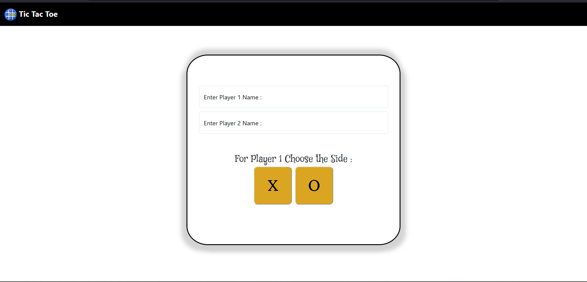
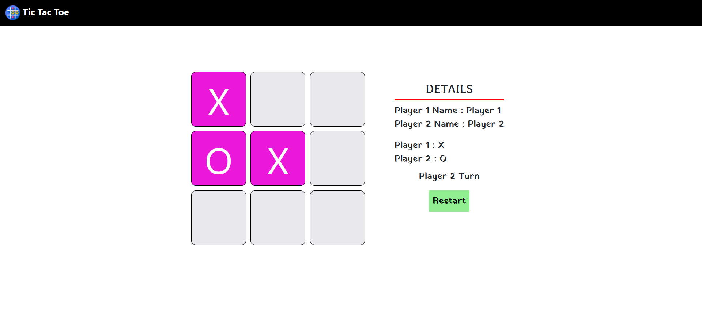
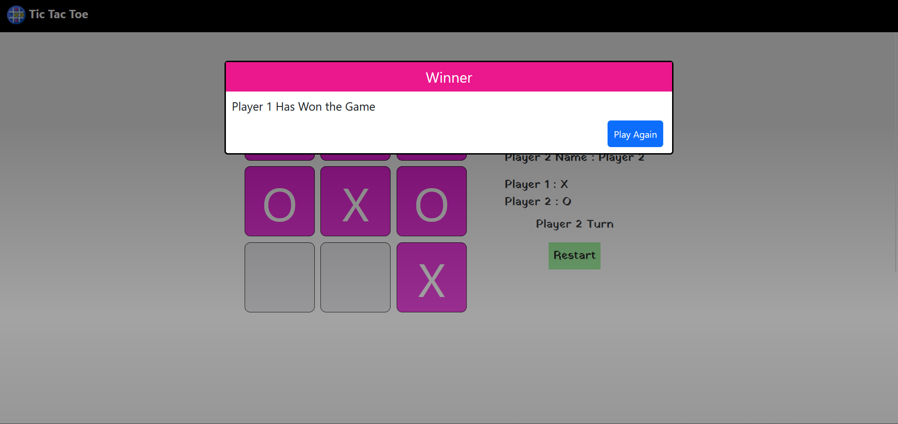

# Tic Tac Toe | Premium Edition

An engaging, modern, and beautifully crafted Tic Tac Toe web game featuring a clean white aesthetic, viewport-optimized layout (no scrolling required), synthesized sound effects, real-time score tracking, and victory celebrations.

## ✨ Features
- **Clean White Modern UI**: Crisp white cards, high-contrast typography, and tailored player accents.
- **Viewport-Optimized**: Designed to fit 100vh screens perfectly without needing to scroll down.
- **Dynamic Scoreboard**: Tracks Player 1 wins, Player 2 wins, and ties across multiple rounds without losing game state.
- **Active Turn Indicators**: Real-time turn pill with pulse animations and glowing player cards showing whose turn it is.
- **Interactive Board**: Tactile 3D tiles with hover lift, pop-in symbol animations, and glowing highlights on winning combinations.
- **Web Audio Sound Effects**: Custom synthesized audio blips for tile clicks, win fanfares, and tie tones (with mute/unmute control).
- **Celebratory Particle Confetti**: Lightweight, high-performance canvas confetti bursts on player victory.
- **Seamless Round Flow**: Quick "Next Round", "Reset Scores", and "Change Players" options to keep the gameplay loop fast and fun.
- **Fully Responsive**: Optimized for desktop, tablets, and mobile screens.

## 🛠️ Technologies Used
- **HTML5**: Clean, semantic structure.
- **CSS3**: Custom design tokens, glassmorphism (`backdrop-filter`), keyframe animations, and flex/grid layouts.
- **JavaScript (ES6+)**: Turn management, win condition algorithms, Web Audio API, and HTML5 Canvas confetti.
- **Font Awesome 6**: Modern vector icons.
- **Google Fonts (Outfit)**: Sleek contemporary typography.

## 📸 Screenshots
1. **Setup Screen**
   

2. **Game Screen**
   

3. **Winner Screen**
   